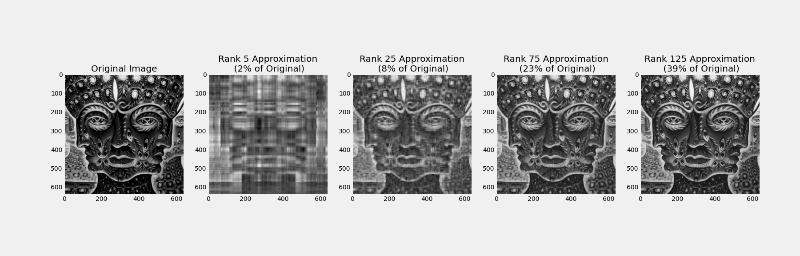
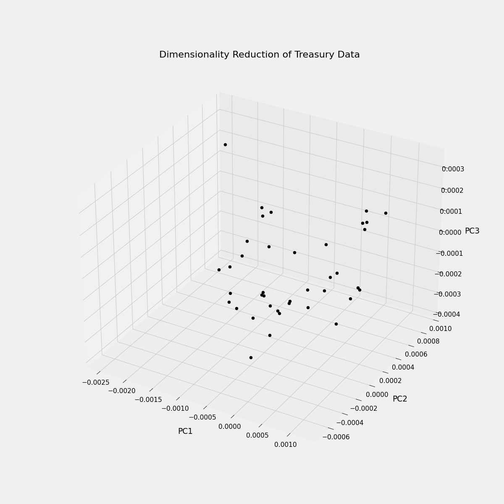

# Singular_Value_Decomposition
In this notebook we take a look at the Singular Value Decomposition (SVD).  We apply it to image compression and Principal Component Analysis in the context of Canadian Treasury rates.  

