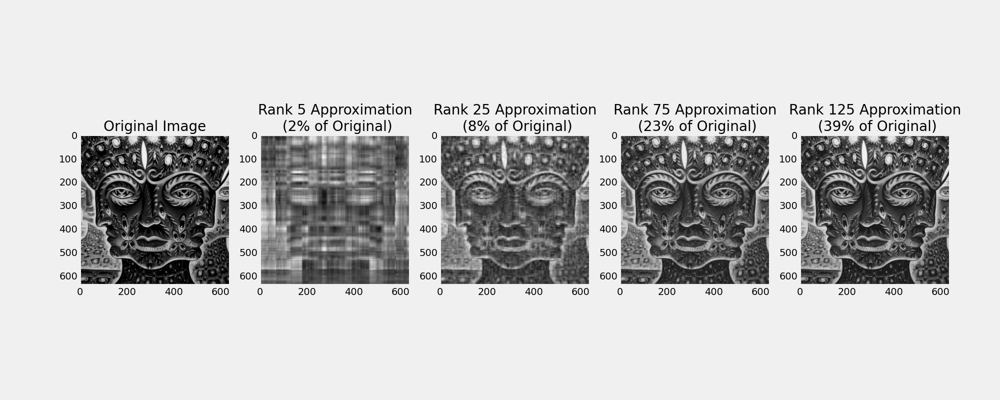

# Singular Value Decomposition
In this notebook we take a look at the Singular Value Decomposition (SVD).  We apply it to image compression and Principal Component Analysis in the context of Canadian Treasury rates.  

See the full analysis [<a href="https://nbviewer.jupyter.org/github/SebastianLech/singular_value_decomposition/blob/main/SVD.ipynb">here</a>]

Screenshots from the Analysis:

